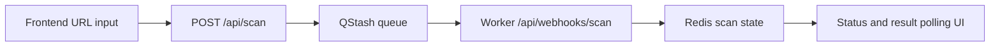

# AuditAI

AuditAI is a Next.js 16 application that scans any public website and returns an AI-readiness report across four pillars:

- Schema Markup
- Content Quality
- Technical SEO
- Trust Signals

The system is designed around a queue-first workflow so scan requests return quickly while heavy analysis runs asynchronously.

Live frontend: https://audit-ai-app.vercel.app

## Core Capabilities

- Fast scan kickoff via `POST /api/scan`
- Queue-backed worker processing through Upstash QStash
- Incremental progress updates for crawl and analysis steps
- Result polling endpoint for UI status and completion
- Persistent scan state with Upstash Redis and in-memory fallback

## Tech Stack

- Next.js 16 (App Router)
- React 19 + TypeScript
- Zod for request validation
- Upstash QStash (job queue)
- Upstash Redis (scan state persistence)
- Playwright + Cheerio (crawl and page parsing)
- Google Generative AI SDK (content analysis)

## Architecture Workflow



## API Endpoints

| Method | Endpoint | Purpose |
| --- | --- | --- |
| `POST` | `/api/scan` | Creates a scan, queues worker job, returns `scanId` |
| `GET` | `/api/scan/:id/status` | Returns progress, step text, and current scan status |
| `GET` | `/api/scan/:id/result` | Returns completed report payload (202 while pending) |
| `POST` | `/api/webhooks/scan` | Worker endpoint triggered by QStash |

## Environment Variables

Create a `.env.local` file and configure:

```bash
# Queue
QSTASH_TOKEN=
QSTASH_URL=https://qstash.upstash.io
SCAN_WORKER_WEBHOOK_URL=
SCAN_WORKER_SECRET=

# State store
UPSTASH_REDIS_REST_URL=
UPSTASH_REDIS_REST_TOKEN=

# AI analyzer
GOOGLE_GENERATIVE_AI_API_KEY=
```

Notes:

- `SCAN_WORKER_WEBHOOK_URL` is optional. If omitted, the app auto-resolves the current host.
- In production, set `SCAN_WORKER_SECRET` and pass it to the worker through QStash forwarded headers.

## Local Development

```bash
npm install
npm run dev
```

Open `http://localhost:3000`.

## Available Scripts

- `npm run dev` - Start development server
- `npm run build` - Build production bundle
- `npm run start` - Start production server
- `npm run lint` - Run ESLint checks

## Project Structure

```text
src/
	app/
		api/
			scan/                 # scan trigger + status/result endpoints
			webhooks/scan/        # worker webhook endpoint
		scan/[id]/              # scan progress and final report page
	components/
		landing/                # landing page sections
		scan/                   # scan modal and input UI
		results/                # report visualizations
	lib/
		scan-store.ts           # state persistence (Redis + memory fallback)
		scanner/                # crawl + analyzers + scoring pipeline
```

## Production Notes

- `POST /api/scan` is intentionally lightweight and only queues work.
- Heavy processing runs in `/api/webhooks/scan` to avoid request timeout risk.
- Worker requests should be protected with `SCAN_WORKER_SECRET` in production.
- Redis is recommended for multi-instance deployments and result durability.

