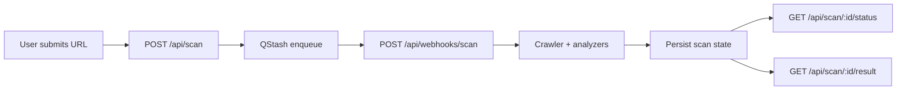

# AuditAI

AuditAI is a Next.js 16 application that scans public websites and generates an AI-readiness report across four pillars:

- Schema Markup
- Content Quality
- Technical SEO
- Trust Signals

The platform uses a queue-first architecture so requests return quickly while crawl and analysis work runs asynchronously.

Live app: https://audit-ai-app.vercel.app

## Highlights

- Fast scan kickoff through POST /api/scan
- Async processing with Upstash QStash
- Worker-based analysis pipeline at /api/webhooks/scan
- Progress + result polling via status/result endpoints
- Redis-backed state with in-memory fallback
- AI-enhanced analysis with Gemini + PageSpeed signals

## Project Structure

The repository is organized to keep routing, UI, and scan logic clearly separated.

```text
AuditAI/
|-- .github/
|   `-- workflows/
|       `-- ci.yml
|-- public/
|-- src/
|   |-- app/
|   |   |-- api/
|   |   |   |-- scan/
|   |   |   |   |-- route.ts
|   |   |   |   `-- [id]/
|   |   |   |       |-- result/route.ts
|   |   |   |       `-- status/route.ts
|   |   |   `-- webhooks/
|   |   |       `-- scan/route.ts
|   |   |-- scan/
|   |   |   `-- [id]/page.tsx
|   |   |-- globals.css
|   |   |-- layout.tsx
|   |   `-- page.tsx
|   |-- components/
|   |   |-- landing/
|   |   |-- layout/
|   |   |-- results/
|   |   `-- scan/
|   `-- lib/
|       |-- scan-store.ts
|       `-- scanner/
|           |-- crawler.ts
|           |-- schema-analyzer.ts
|           |-- content-analyzer.ts
|           |-- tech-seo.ts
|           |-- trust-signals.ts
|           |-- scorer.ts
|           `-- types.ts
|-- .env.example
|-- next.config.ts
|-- package.json
`-- README.md
```

### Directory Guide

- src/app: App Router pages and API routes
- src/components: UI components grouped by domain
- src/lib/scanner: Crawl, analyze, score pipeline
- src/lib/scan-store.ts: Scan persistence abstraction
- .github/workflows: CI and deployment automation

## Architecture



## API Endpoints

| Method | Endpoint | Description |
| --- | --- | --- |
| POST | /api/scan | Creates a scan and enqueues worker job |
| GET | /api/scan/:id/status | Returns status, step text, and progress |
| GET | /api/scan/:id/result | Returns final report (202 while pending) |
| POST | /api/webhooks/scan | Worker endpoint invoked by QStash |

## Tech Stack

- Next.js 16 (App Router)
- React 19 + TypeScript
- Zod validation
- Upstash QStash (queue)
- Upstash Redis (state store)
- Playwright + Cheerio (crawl/parsing)
- Google Generative AI SDK

## Local Setup

### 1) Prerequisites

- Node.js 20+
- npm 10+

### 2) Install

```bash
npm install
```

### 3) Configure environment

Copy the sample file and fill values:

```bash
cp .env.example .env.local
```

PowerShell alternative:

```powershell
Copy-Item .env.example .env.local
```

### 4) Run

```bash
npm run dev
```

Open http://localhost:3000

## Environment Variables

### Core scan pipeline

| Variable | Required | Notes |
| --- | --- | --- |
| QSTASH_TOKEN | Yes (queue mode) | Auth token for Upstash QStash |
| QSTASH_URL | Optional | Defaults to https://qstash.upstash.io |
| SCAN_WORKER_WEBHOOK_URL | Recommended in production | Explicit public webhook URL |
| SCAN_WORKER_SECRET | Recommended | Protects worker endpoint |
| UPSTASH_REDIS_REST_URL | Recommended | Enables persistent scan state |
| UPSTASH_REDIS_REST_TOKEN | Recommended | Redis auth token |

### Analysis providers

| Variable | Required | Notes |
| --- | --- | --- |
| GOOGLE_PAGESPEED_API_KEY | Optional | Enables PageSpeed-based signals |
| GEMINI_API_KEY | Optional | Enables AI-assisted analysis |
| GEMINI_MODEL | Optional | Defaults to gemini-2.5-flash |

### Additional app variables

Stripe and Supabase variables in .env.example are reserved for billing/data features and can remain unset for core scanning.

## Scripts

| Command | Purpose |
| --- | --- |
| npm run dev | Start development server |
| npm run build | Create production build |
| npm run start | Run production server |
| npm run lint | Run ESLint |

## Production and Deployment Notes

- Keep POST /api/scan lightweight; it should queue and return quickly.
- Run heavy analysis only in the worker route.
- Always protect /api/webhooks/scan with SCAN_WORKER_SECRET in production.
- Prefer Redis-backed state in multi-instance deployments.
- Set all production environment variables in Vercel project settings.

## Validation Checklist

Run before shipping:

```bash
npm run lint
npm run build
```

## Security Checklist

- Never commit .env.local
- Rotate any exposed API keys or tokens immediately
- Restrict webhook access with shared secret validation
- Keep dependencies updated

## License

Private project. Add a license section if this repository is made public.

